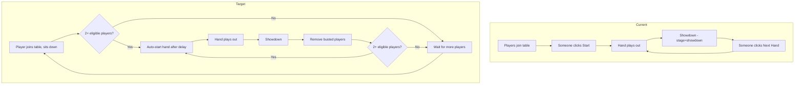
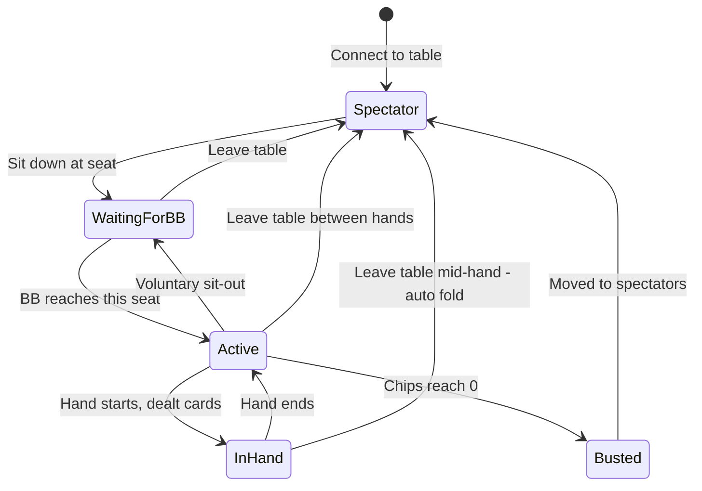

# Plan: Auto-Start Continuous Game (Remove Start Button)

## Goal
Replace the manual "Start Game" / "Next Hand" button with automatic continuous dealing, matching real cash-game poker behavior:
- Hands start automatically when 2+ eligible players are seated
- Hands loop infinitely until ≤1 player with chips remains
- New players joining mid-hand wait until the big blind reaches them
- Players can leave at any time (auto-fold if in a hand)

---

## Current Flow vs Target Flow



---

## Player Lifecycle



---

## Detailed Changes by File

### 1. `types/index.ts` — Type Changes

**Player interface** — add two new fields:
```typescript
export interface Player {
  // ... existing fields ...
  waitingForBB: boolean;  // NEW: player joined mid-game, waiting for BB to reach them
  sittingOut: boolean;    // NEW: player voluntarily sitting out
}
```

**ClientEvents** — remove manual game control:
```typescript
export interface ClientEvents {
  join: (seat: number) => void;
  getState: () => void;
  // REMOVED: start, reset
  // ADDED:
  sitOut: () => void;     // voluntary sit-out
  sitIn: () => void;      // return from sit-out (will wait for BB)
  // ... rest unchanged ...
}
```

**GameState** — optionally add a `nextHandIn` field:
```typescript
export interface GameState {
  // ... existing fields ...
  nextHandIn: number | null;  // NEW: timestamp when next hand starts (for countdown UI)
}
```

### 2. `server/Game.ts` — Core Game Logic

This is the biggest change. Key modifications:

#### a) `addPlayer()` — Allow joining at any time
- Remove the restriction `if (this.stage !== 'waiting' && this.stage !== 'showdown') return false`
- New players always get `waitingForBB: true` (unless the table is in `waiting` stage with no active hand)
- If the game is in `waiting` stage and this is the 2nd player, they do NOT need to wait for BB

#### b) New method: `getEligiblePlayers()` 
Returns players who are eligible to participate in the NEXT hand:
- Has chips > 0
- Not `waitingForBB` (unless BB is about to reach them)
- Not `sittingOut`

#### c) New method: `startNextHand()`
Replaces the old `start()`:
- Checks `getEligiblePlayers().length >= 2`
- Activates any `waitingForBB` players whose seat is at or past the new BB position
- Calls `reset()` internally (but does NOT set stage to `waiting` — goes straight to `preflop`)
- Deals cards only to eligible players
- Posts blinds, sets first player

#### d) BB position tracking for `waitingForBB`
When starting a new hand:
1. Calculate the new BB position based on dealer movement
2. For each `waitingForBB` player: if the BB position is at their seat OR has passed their seat since they joined, set `waitingForBB = false` and include them in the hand
3. Simple approach: when a new hand starts, check if the BB seat matches a `waitingForBB` player — if so, activate them

#### e) `removePlayer()` — Handle mid-hand removal
- If the player is currently in a hand (has cards, not folded), auto-fold them first
- If it is their turn (`currentPlayer === their seat`), fold and advance
- Then remove from seat
- Check if hand should continue (if only 1 player left, they win)

#### f) Dealer movement
Currently `dealerPosition` advances in `showdown()`. This should be moved to `startNextHand()` so it happens before blind posting. The dealer should skip empty seats and `sittingOut`/`waitingForBB` seats.

### 3. `server/models/Table.ts` — Auto-Start Timer

#### a) Add auto-start timer
```typescript
private nextHandTimer: NodeJS.Timeout | null = null;
private readonly NEXT_HAND_DELAY = 3000; // 3 seconds between hands
```

#### b) New method: `scheduleNextHand()`
Called after showdown completes:
```
- Clear any existing timer
- Check if 2+ eligible players exist
- If yes: set timer for NEXT_HAND_DELAY, then call game.startNextHand()
- If no: do nothing (will be triggered when a new player joins)
```

#### c) New method: `tryStartNextHand()`
Called when a player joins or sits in:
```
- If game is in 'waiting' stage and 2+ eligible players exist
- Schedule next hand (or start immediately if no hand has been played yet)
```

#### d) Update `addPlayer()`
After successfully adding a player, call `tryStartNextHand()`.

#### e) Update `removePlayer()`
- Call `game.removePlayer()` which handles mid-hand fold
- If game is still running, update state
- If game ended due to removal, schedule next hand or go to waiting

### 4. `server/index.ts` — Socket Event Handlers

#### a) Remove handlers
- Remove `socket.on("start", ...)` handler
- Remove `socket.on("reset", ...)` handler

#### b) Update `handleTableShowdown()`
After processing showdown results and removing busted players:
```typescript
// Schedule next hand automatically
setTimeout(() => {
  table.scheduleNextHand();
}, 100); // small delay to let state propagate
```

#### c) Update `leaveTable` handler
```typescript
socket.on("leaveTable", () => {
  const table = tableManager.getPlayerTable(socket.id);
  if (table) {
    table.removePlayerMidGame(socket.id); // handles fold if needed
    // ... rest of cleanup
  }
});
```

#### d) Update `disconnect` handler
Same as leaveTable — ensure mid-hand fold happens.

#### e) Add new handlers
```typescript
socket.on("sitOut", () => handleGameAction('sitOut'));
socket.on("sitIn", () => handleGameAction('sitIn'));
```

### 5. `client/src/components/GameControls.tsx` — UI Changes

#### a) Remove start/reset buttons
The entire block at lines 52-81 that shows "Начать игру" / "Следующая раздача" gets replaced.

#### b) Showdown state — show countdown
When `stage === 'showdown'`:
- Show "Раздача завершена!" message
- Show countdown: "Следующая раздача через X сек..."
- Show "Показать карты" button if applicable

#### c) Waiting state — show status
When `stage === 'waiting'`:
- If player is seated: "Ожидание игроков... (X/2 минимум)"
- If player has `waitingForBB`: "Ожидание большого блайнда..."

#### d) Sit Out / Sit In toggle
Add a toggle button for seated players to sit out / sit back in.

### 6. `client/src/pages/GameRoom.tsx` — Minor UI Updates

- Remove any references to start/reset buttons
- The leave-table functionality already exists via back button
- Add visual indicator for `waitingForBB` players on the table

---

## Edge Cases to Handle

| Scenario | Behavior |
|----------|----------|
| Only 1 player at table | Stay in `waiting` stage, show "Waiting for players" |
| 2nd player joins | Auto-start first hand after short delay |
| Player disconnects mid-hand | Auto-fold, continue hand. If only 1 left, they win |
| All players bust except 1 | Move busted to spectators, go to `waiting` |
| Player joins during showdown delay | Mark as `waitingForBB`, include in next hand if BB reaches them |
| BB player has 0 chips | Skip them, they get moved to spectators |
| All players sit out | Go to `waiting` stage |
| Player sits back in | Set `waitingForBB = true`, activate when BB reaches them |
| Heads-up (2 players) | Dealer posts SB, other posts BB. Standard heads-up rules |
| 3rd player joins heads-up hand | Waits for BB, enters on next hand where BB is at their seat |

---

## Implementation Order

1. **Types first** — update `Player`, `ClientEvents`, `GameState` in `types/index.ts`
2. **Game.ts core** — refactor player management, add `startNextHand()`, `getEligiblePlayers()`, mid-hand removal
3. **Table.ts** — add auto-start timer, `scheduleNextHand()`, `tryStartNextHand()`
4. **index.ts** — update socket handlers, remove start/reset, wire up auto-start
5. **GameControls.tsx** — remove buttons, add status messages and countdown
6. **GameRoom.tsx** — minor UI cleanup
7. **Testing** — verify all edge cases

---

## Files Modified

| File | Changes |
|------|---------|
| `types/index.ts` | Add `waitingForBB`, `sittingOut` to Player; add `nextHandIn` to GameState; remove `start`/`reset` from ClientEvents; add `sitOut`/`sitIn` |
| `server/Game.ts` | Major refactor: `addPlayer()`, new `startNextHand()`, `getEligiblePlayers()`, `removePlayer()` mid-hand, dealer movement |
| `server/models/Table.ts` | Add auto-start timer, `scheduleNextHand()`, `tryStartNextHand()`, update `addPlayer()`/`removePlayer()` |
| `server/index.ts` | Remove `start`/`reset` handlers, update showdown handler, update leave/disconnect, add `sitOut`/`sitIn` |
| `client/src/components/GameControls.tsx` | Remove start button, add countdown, waiting status, sit-out toggle |
| `client/src/pages/GameRoom.tsx` | Minor UI updates for new player states |
