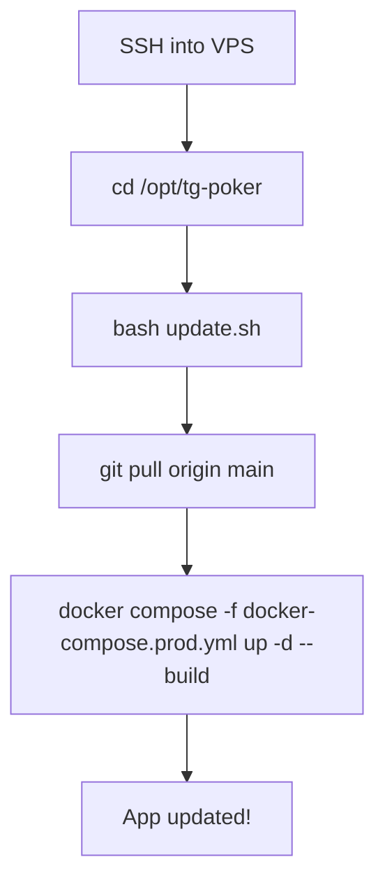

# Git-Based Deployment Setup Plan

## Current State
- Project has **no git repository** initialized
- Deployment uses **tar archive + scp** via `upload.ps1`
- VPS is already deployed at `/opt/tg-poker` with Docker Compose
- `.gitignore` exists but needs minor updates

## Target State
- Local git repo → GitHub private repo
- VPS clones from GitHub
- Updates via `git pull` + `docker compose up -d --build`

---

## Deployment Flow


## Update Flow on VPS



---

## Step-by-Step Plan

### Step 1: Update `.gitignore`

Add missing entries to prevent committing build artifacts and sensitive files:

```
# Add these lines:
*.tar
prod-check.png
.env.production
```

Note: `plans/` is currently in `.gitignore` — we should **remove it** so plans are tracked in git. The plans directory contains useful architecture docs.

### Step 2: Initialize git repository locally

```bash
cd c:\Projects\tg-poker
git init
git add .
git commit -m "Initial commit: TG Poker Telegram Mini App"
```

### Step 3: Create GitHub private repository

1. Create a new private repo on GitHub (e.g., `tg-poker`)
2. Add remote and push:

```bash
git remote add origin git@github.com:<username>/tg-poker.git
git branch -M main
git push -u origin main
```

### Step 4: Create `update.sh` script for VPS

A simple script that pulls latest code and rebuilds:

```bash
#!/bin/bash
# update.sh — Pull latest code and rebuild
set -e

APP_DIR="/opt/tg-poker"
cd ${APP_DIR}

echo "Pulling latest changes..."
git pull origin main

echo "Rebuilding and restarting services..."
docker compose -f docker-compose.prod.yml up -d --build

echo "Waiting for services..."
sleep 10

echo "Service status:"
docker compose -f docker-compose.prod.yml ps

echo "Update complete!"
```

### Step 5: Set up SSH deploy key on VPS

On the VPS:
```bash
# Generate SSH key for GitHub access
ssh-keygen -t ed25519 -C "tg-poker-vps-deploy" -f ~/.ssh/github_deploy -N ""

# Show public key to add to GitHub
cat ~/.ssh/github_deploy.pub

# Configure SSH to use this key for GitHub
cat >> ~/.ssh/config << 'EOF'
Host github.com
    HostName github.com
    User git
    IdentityFile ~/.ssh/github_deploy
    IdentitiesOnly yes
EOF
```

Then add the public key as a **Deploy Key** in GitHub repo settings (Settings → Deploy keys → Add deploy key, read-only access is sufficient).

### Step 6: Clone repo on VPS (one-time migration)

```bash
# Backup current deployment
mv /opt/tg-poker /opt/tg-poker-backup

# Clone from GitHub
git clone git@github.com:<username>/tg-poker.git /opt/tg-poker

# Restore .env from backup
cp /opt/tg-poker-backup/.env /opt/tg-poker/.env

# Rebuild
cd /opt/tg-poker
docker compose -f docker-compose.prod.yml up -d --build
```

### Step 7: Update `DEPLOY.md`

Update the deployment documentation to reflect the new git-based workflow:
- Remove tar/scp instructions as primary method
- Make git clone the primary deployment method
- Document the `update.sh` script usage
- Document deploy key setup

### Step 8: Clean up obsolete files

Remove files that are no longer needed with git-based deployment:
- `upload.ps1` — replaced by `git push`
- `tg-poker-deploy.tar` — build artifact, should not be in repo

---

## Files to Create/Modify

| File | Action | Description |
|------|--------|-------------|
| `.gitignore` | Modify | Add `*.tar`, `prod-check.png`; remove `plans/` |
| `update.sh` | Create | VPS update script: git pull + rebuild |
| `DEPLOY.md` | Modify | Update with git-based workflow |
| `upload.ps1` | Delete | No longer needed |
| `tg-poker-deploy.tar` | Delete | Build artifact |

## Manual Steps (not automatable)

1. Create GitHub private repository via github.com
2. Generate SSH deploy key on VPS
3. Add deploy key to GitHub repo settings
4. Clone repo on VPS (one-time migration)
