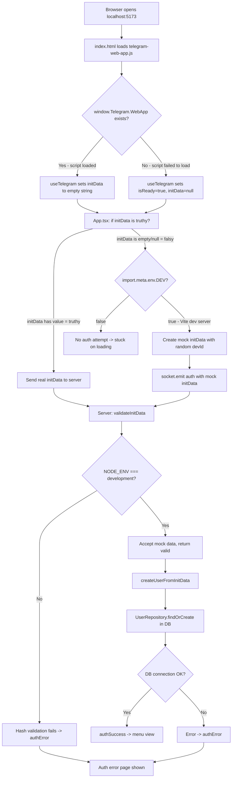

# Local Development Testing Plan

## Problem

After integrating Telegram WebApp authentication, opening `http://localhost:5173/` in a browser shows "Ошибка авторизации" (Authentication failed). Previously, developers could open multiple browser tabs to simulate different players for local testing.

## Root Cause Analysis

The authentication flow has multiple potential failure points when running locally:

### Flow Diagram

### Identified Issues

1. **Telegram script behavior**: `telegram-web-app.js` from CDN may or may not create `window.Telegram.WebApp` when loaded outside Telegram. If it sets `initData` to a non-empty but invalid value, the client sends it as real data instead of using the dev mock path.

2. **Server NODE_ENV**: The server must have `NODE_ENV=development` set. The `.env` file has it, but if the server is started without `dotenv` loading first, or if the compiled JS in `dist/` is run without the env, validation fails.

3. **Database dependency**: Even in dev mode, `createUserFromInitData` calls `UserRepository.findOrCreate` which requires a working PostgreSQL connection. If the DB is down, auth fails silently.

4. **Random devId on every page load**: Each browser refresh generates a new random `devId` (line 86 in App.tsx), creating a new user every time. This makes testing inconsistent and fills the DB with junk users.

5. **No way to control which dev user you are**: You cannot choose a specific player identity when testing multi-player scenarios.

## Solution: Robust Dev Mode with URL-based Player Selection

### Approach

Add a dev mode that:
- Works reliably without Telegram WebApp
- Allows simulating multiple players via URL query parameters
- Persists player identity per browser tab using `sessionStorage`
- Bypasses Telegram script entirely in dev mode
- Provides clear visual indicator that dev mode is active

### Changes Required

#### 1. Client: `useTelegram.ts` — Detect dev mode earlier

- Check `import.meta.env.DEV` at the start
- In dev mode, skip Telegram WebApp initialization entirely
- Set `isReady = true` immediately with `initData = null`

#### 2. Client: `App.tsx` — URL-based dev player selection

- Support URL parameter `?player=1` through `?player=6` for quick multi-tab testing
- Use `sessionStorage` to persist the player ID within a tab
- If no `?player=` param and no stored ID, assign a random one and store it
- Show a small dev toolbar at the top with current player info and quick-switch links

#### 3. Server: `auth.ts` — More robust dev mode handling

- In dev mode, accept auth even without valid initData
- Use deterministic dev user IDs based on `devId` parameter (e.g., `devId=1` -> `telegramId=100001`)
- Add better error logging for auth failures

#### 4. Server: `index.ts` — Better dev mode error handling

- Wrap `createUserFromInitData` in try/catch with meaningful error messages
- If DB is unavailable in dev mode, fall back to in-memory user creation

#### 5. Client: Dev toolbar component

- Small floating bar showing: current dev player number, balance, quick links to open other players
- Only rendered when `import.meta.env.DEV` is true
- Does not affect production build at all (tree-shaken out)

### File Changes Summary

| File | Change |
|------|--------|
| `client/src/hooks/useTelegram.ts` | Skip Telegram init in DEV mode |
| `client/src/App.tsx` | Add URL-based dev player selection, dev toolbar |
| `server/middleware/auth.ts` | More robust dev mode validation, deterministic IDs |
| `server/index.ts` | Better error handling in auth flow |
| `client/src/components/DevToolbar.tsx` | NEW: Dev-only toolbar component |

### Usage After Implementation

1. Start server: `npm run dev`
2. Start client: `cd client && npm run dev`
3. Open `http://localhost:5173/?player=1` — plays as Dev Player 1
4. Open `http://localhost:5173/?player=2` in another tab — plays as Dev Player 2
5. Both players can join the same table and play against each other
6. The dev toolbar shows which player you are and provides links to open other player tabs

### Safety

- All dev mode code is gated behind `import.meta.env.DEV` (client) and `process.env.NODE_ENV === 'development'` (server)
- Vite tree-shakes dev-only code from production builds
- The `DevToolbar` component is only imported conditionally
- No security risk in production since dev paths are completely removed
