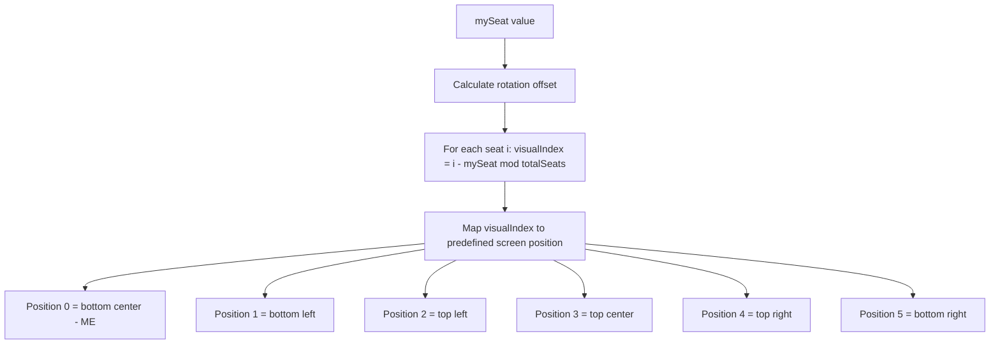

# Mobile Table Layout Adaptation Plan

## Overview
Adapt the poker table UI for mobile devices (Telegram Mini App). Add Tailwind CSS for styling, implement seat rotation so the current player always sees themselves at the bottom center, and make the chat collapsible.

## Current State
- Fixed table dimensions: 700×400px with inline styles
- Seats positioned via absolute positioning + trigonometry around an ellipse
- No Tailwind CSS — all styling via inline styles + `telegram.css`
- Chat always visible as a 320px sidebar
- No seat rotation — all players see the same layout
- Tables support up to 6 players

## Architecture

### Mobile Layout (vertical stack)

```
┌─────────────────────────┐
│  Header: Table # | Stage│  ← compact header
├─────────────────────────┤
│                         │
│    ┌───┐       ┌───┐    │  ← seats 2, 3 (top)
│    └───┘       └───┘    │
│  ┌───┐    POT    ┌───┐  │  ← seats 1, 4 (sides)
│  └───┘  CARDS    └───┘  │
│    ┌───┐       ┌───┐    │  ← seats 5, 0 (bottom)
│    └───┘       └───┘    │
│         ┌─────┐         │
│         │ ME  │         │  ← always at bottom center
│         └─────┘         │
├─────────────────────────┤
│  [Fold] [Check] [Raise] │  ← game controls (sticky bottom)
├─────────────────────────┤
│  💬 Chat toggle button  │  ← collapsed by default
└─────────────────────────┘
```

### Seat Rotation Algorithm

For a 6-player table, the canonical seat positions (0-5) map to visual positions around the ellipse. When `mySeat = N`, we rotate all seats so that seat N appears at the bottom center.



The visual positions for a 6-seat table on mobile:

| Visual Index | Position Description | CSS Position |
|---|---|---|
| 0 | Bottom center - current player | `bottom: 0, left: 50%` |
| 1 | Bottom-left | `bottom: 15%, left: 5%` |
| 2 | Top-left | `top: 5%, left: 15%` |
| 3 | Top-center | `top: 0, left: 50%` |
| 4 | Top-right | `top: 5%, right: 15%` |
| 5 | Bottom-right | `bottom: 15%, right: 5%` |

### Responsive Table Sizing

Instead of fixed 700×400, the table will use:
- **Width**: `w-full max-w-[700px]` — fills mobile screen, caps at 700px on desktop
- **Height**: `aspect-[7/4]` — maintains the elliptical proportion
- **Seats**: sized with `w-16 h-20 sm:w-20 sm:h-24 md:w-28 md:h-28` — scaling up on larger screens
- **Cards**: `size={40}` on mobile, `size={60}` on desktop via a `useRef` + `ResizeObserver` or media query hook

## Implementation Steps

### Step 1: Install Tailwind CSS v4

Install `@tailwindcss/vite` and `tailwindcss` in the client project. Configure `vite.config.ts` to use the Tailwind Vite plugin. Add `@import "tailwindcss"` to the main CSS entry point.

**Files changed:**
- `client/package.json` — new deps
- `client/vite.config.ts` — add tailwind plugin
- `client/src/styles/telegram.css` — add tailwind import at top

### Step 2: Refactor Table.tsx — Responsive Container

Replace fixed `width`/`height` inline styles with Tailwind classes. Use `useRef` to measure actual container dimensions and pass them to `SeatsDisplay`. Remove `tableWidth`/`tableHeight` props in favor of a ref-based approach.

**Files changed:**
- `client/src/components/Table.tsx`

### Step 3: Refactor SeatsDisplay.tsx — Seat Rotation + Responsive

- Accept `mySeat` and compute `visualIndex` for each seat
- Use predefined position maps instead of trigonometric calculations
- Use percentage-based positioning for responsiveness
- Scale seat content based on container size

**Files changed:**
- `client/src/components/SeatsDisplay.tsx`

### Step 4: Refactor GameRoom.tsx — Mobile-First Layout

- Remove embedded `<style>` block, replace with Tailwind classes
- Make the layout a vertical stack on mobile
- Sticky game controls at the bottom
- Add chat toggle button

**Files changed:**
- `client/src/pages/GameRoom.tsx`

### Step 5: Collapsible Chat

- Add `isChatOpen` state to `GameRoom.tsx`
- Chat panel slides up from bottom as an overlay when opened
- Toggle button with unread message count badge
- Chat hidden by default

**Files changed:**
- `client/src/pages/GameRoom.tsx` — state + toggle button
- `client/src/components/Chat.tsx` — accept `isOpen`/`onClose` props, add close button

### Step 6: Mobile-Friendly GameControls

- Replace inline styles with Tailwind classes
- Larger touch targets: min 44×44px
- Raise slider instead of number input on mobile
- Sticky positioning at bottom of viewport

**Files changed:**
- `client/src/components/GameControls.tsx`

### Step 7: Responsive CommunityCards + PotDisplay

- Cards scale based on available space
- PotDisplay uses smaller font on mobile

**Files changed:**
- `client/src/components/CommunityCards.tsx`
- `client/src/components/PotDisplay.tsx`

### Step 8: Clean Up telegram.css

- Remove game-room layout styles that are now handled by Tailwind
- Keep animations, chat styles, and Telegram theme variables
- Ensure no conflicts with Tailwind reset

**Files changed:**
- `client/src/styles/telegram.css`

## Key Technical Decisions

1. **Tailwind v4** — uses the new `@tailwindcss/vite` plugin, no `tailwind.config.js` needed
2. **Ref-based sizing** — use `useRef` + `useEffect` with `ResizeObserver` to measure the table container and pass dimensions to children, ensuring seats scale correctly
3. **Predefined position maps** — instead of trigonometric seat placement, use a lookup table of CSS positions for each visual index. This is more predictable and easier to make responsive
4. **Chat as overlay** — on mobile, chat opens as a bottom sheet overlay rather than taking layout space
5. **No breaking changes to types** — all changes are client-side only

## Risk Considerations

- **Seat positioning edge cases**: When `mySeat` is `null` (spectator), no rotation is applied — seats show in default order
- **Different table sizes**: Currently all tables are 6-player. The position map should be parameterized by `seats.length` for future support of 2, 4, 8, 9 player tables
- **Tailwind + existing CSS**: The Tailwind reset (preflight) may affect existing styles. Need to verify all pages still look correct after integration
