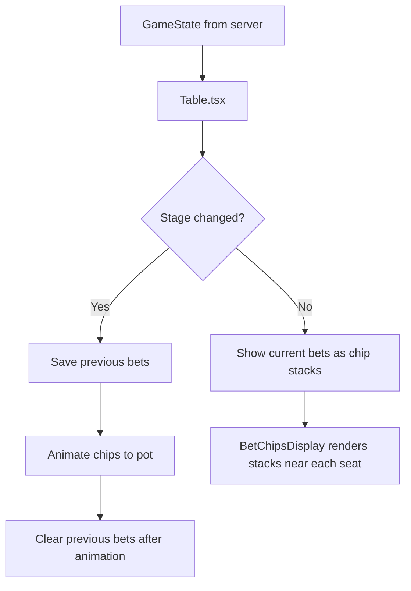
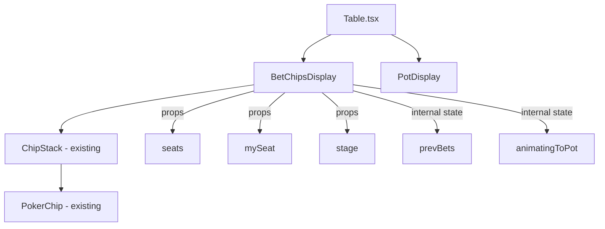
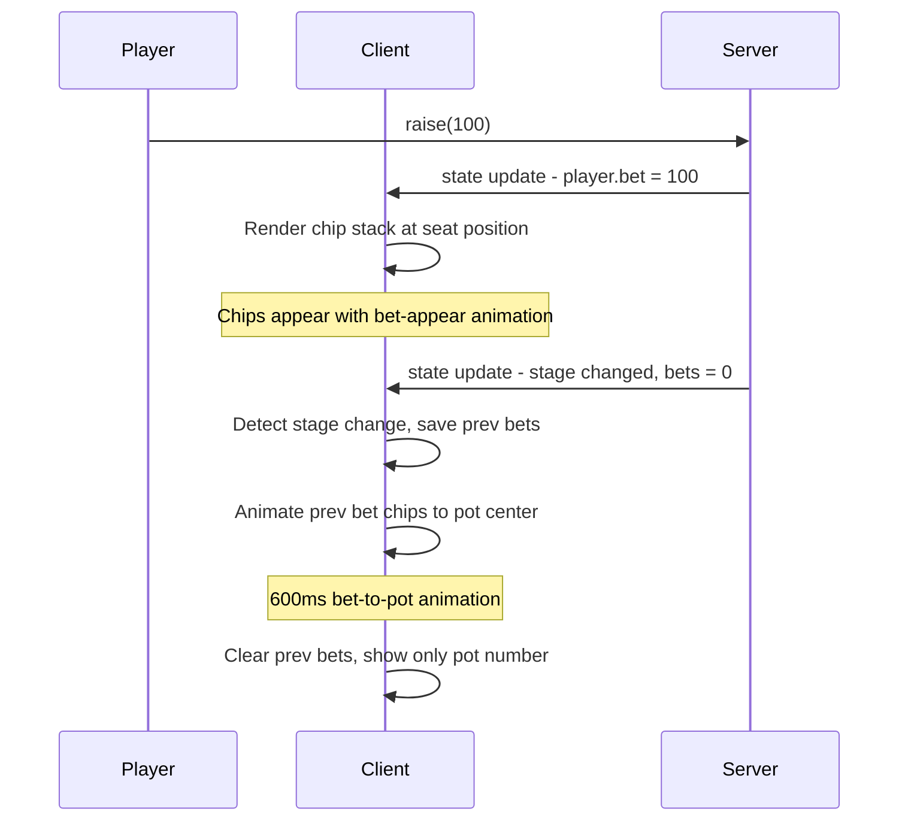

# Table Chips Display — Implementation Plan

## Overview

Display chip stacks on the poker table felt near each player's seat when they place bets. Chips should be colored by denomination to visually indicate bet size. When a betting round ends (stage transition), chip stacks animate toward the pot center and disappear, leaving only the pot number display.

## Architecture

### Data Flow



### Key Insight: Bet Lifecycle

The server resets `player.bet` to 0 when `nextStage()` is called. By the time the client receives the new state, bets are already 0. To animate chips moving to the pot, we need to:

1. **Track previous bets** in the client using `useRef` or `useState`
2. **Detect stage transitions** by comparing `stage` with previous stage
3. **On stage change**: show the *previous* bets animating to center, then clear them
4. **During betting**: show current `player.bet` values as chip stacks

### Component Structure



## Detailed Design

### 1. Bet Chip Positions

Similar to `DEALER_BUTTON_ON_TABLE` in `DealerButton.tsx`, define positions between each seat and the table center. These should be inside the felt ellipse, closer to the seat than the center.

```
Seat 0 (Bottom Center):  left: 50%, top: 72%   — above the seat, inside felt
Seat 1 (Bottom Left):    left: 25%, top: 62%   — right of seat, inside felt
Seat 2 (Top Left):       left: 25%, top: 38%   — right of seat, inside felt
Seat 3 (Top Center):     left: 50%, top: 28%   — below the seat, inside felt
Seat 4 (Top Right):      left: 75%, top: 38%   — left of seat, inside felt
Seat 5 (Bottom Right):   left: 75%, top: 62%   — left of seat, inside felt
```

These positions are percentages of the **outer container** (same coordinate system as seats and dealer button).

### 2. BetChipsDisplay Component

**File**: `client/src/components/BetChipsDisplay.tsx`

**Props**:
- `seats: (Player | null)[]` — current seat data with bet amounts
- `mySeat: number | null` — for rotation calculation
- `stage: string` — current game stage

**Internal State**:
- `prevBets: number[]` — bets from the previous render (before stage change)
- `animatingToPot: boolean` — whether chips are currently animating to pot
- `prevStage: string` — to detect stage transitions

**Logic**:
1. On each render, compare `stage` with `prevStage`
2. If stage changed AND previous bets existed:
   - Set `animatingToPot = true`
   - After animation duration (~600ms), set `animatingToPot = false` and clear `prevBets`
3. If not animating:
   - Show current `player.bet` values as chip stacks at bet positions
4. If animating:
   - Show `prevBets` values with CSS animation moving them to center (50%, 50%)

### 3. ChipStack Modifications

The existing `ChipStack` component in `PokerChip.tsx` is suitable but needs minor adjustments:
- Use `size='sm'` for table bet display (chips are small on the table)
- Reduce `maxChips` to 5 for compact display
- Add a bet amount label above the stack

### 4. CSS Animations

**New keyframes** in `telegram.css`:

```css
@keyframes bet-to-pot {
  0% {
    transform: translate(var(--start-x), var(--start-y)) scale(1);
    opacity: 1;
  }
  100% {
    transform: translate(0, 0) scale(0.5);
    opacity: 0;
  }
}

@keyframes bet-appear {
  0% {
    transform: scale(0);
    opacity: 0;
  }
  100% {
    transform: scale(1);
    opacity: 1;
  }
}
```

For the "move to pot" animation, each chip stack will transition its `left` and `top` CSS properties to the center of the table (50%, 50%) using CSS transitions, then fade out.

### 5. Integration into Table.tsx

Add `BetChipsDisplay` inside the table felt div, alongside `PotDisplay` and `CommunityCards`:

```tsx
{/* Inside the table felt div */}
<BetChipsDisplay
  seats={seats}
  mySeat={mySeat}
  stage={stage}
/>
```

The component renders with `position: absolute` relative to the outer container (same as dealer button and seats).

### 6. Remove Text Bet Display from SeatsDisplay

Currently `SeatsDisplay.tsx` line 132 shows `player.bet` as text inside the seat box:
```tsx
{player.bet > 0 && <div className="text-blue-300 font-bold text-[9px]">{player.bet}</div>}
```

This should be **removed** since bets will now be shown as chip stacks on the table.

## File Changes Summary

| File | Action | Description |
|------|--------|-------------|
| `client/src/components/BetChipsDisplay.tsx` | **CREATE** | New component for rendering bet chip stacks on the table |
| `client/src/components/Table.tsx` | **MODIFY** | Import and render BetChipsDisplay, pass seats/mySeat/stage |
| `client/src/components/SeatsDisplay.tsx` | **MODIFY** | Remove text bet display from seat boxes |
| `client/src/components/PokerChip.tsx` | **MODIFY** | Minor: export getChipColor for reuse, possibly adjust ChipStack for small sizes |
| `client/src/styles/telegram.css` | **MODIFY** | Add bet-to-pot and bet-appear animations |

## Chip Denomination Color Reference

From existing `PokerChip.tsx`:
- **>=1000**: Black (#212121)
- **>=500**: Purple (#7b1fa2)
- **>=100**: Blue (#1e88e5)
- **>=50**: Green (#43a047)
- **>=25**: Yellow (#ffb300)
- **>=10**: Red (#e53935)
- **<10**: Orange (#fb8c00)

## Animation Timeline



## Edge Cases

1. **Player goes all-in**: Large chip stack — cap at maxChips=5, show bet amount label
2. **Multiple stage transitions quickly**: Debounce/cancel previous animation
3. **Player folds during betting**: Their bet stays until stage change (server handles this)
4. **Showdown**: No bets to display, pot shows final amounts
5. **Waiting stage**: No bets, no chips displayed
