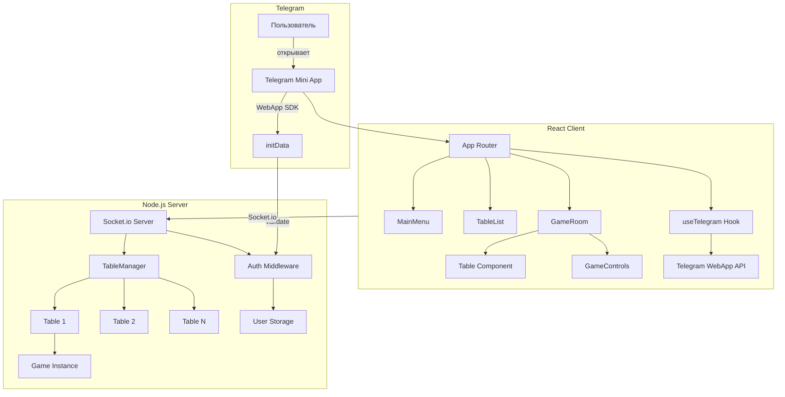
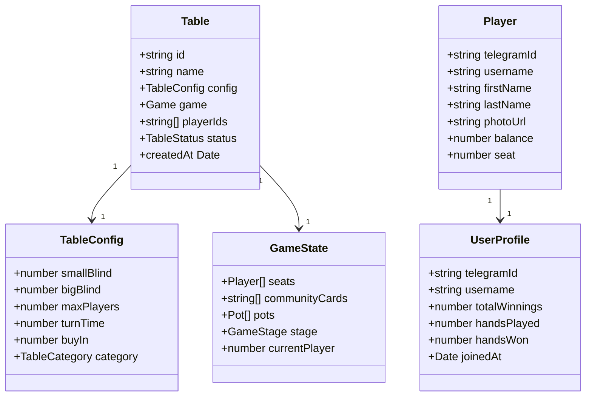
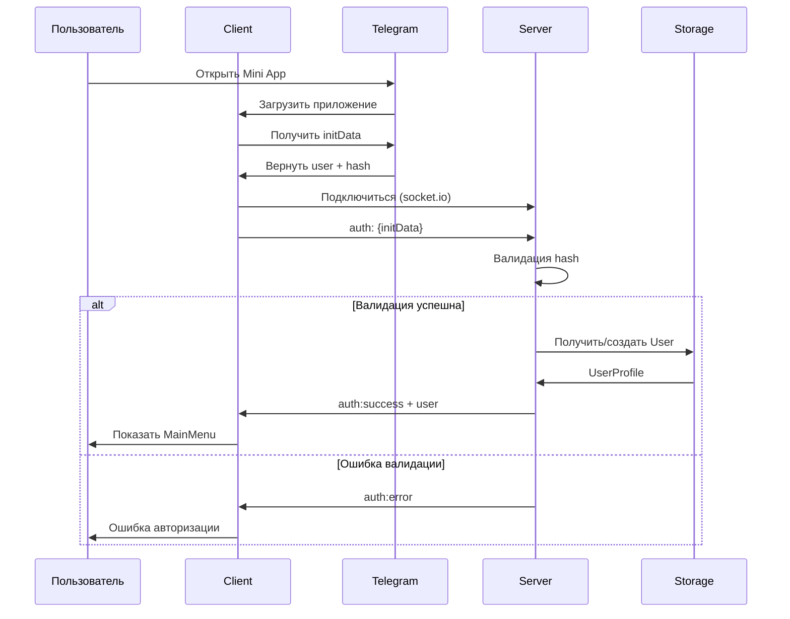
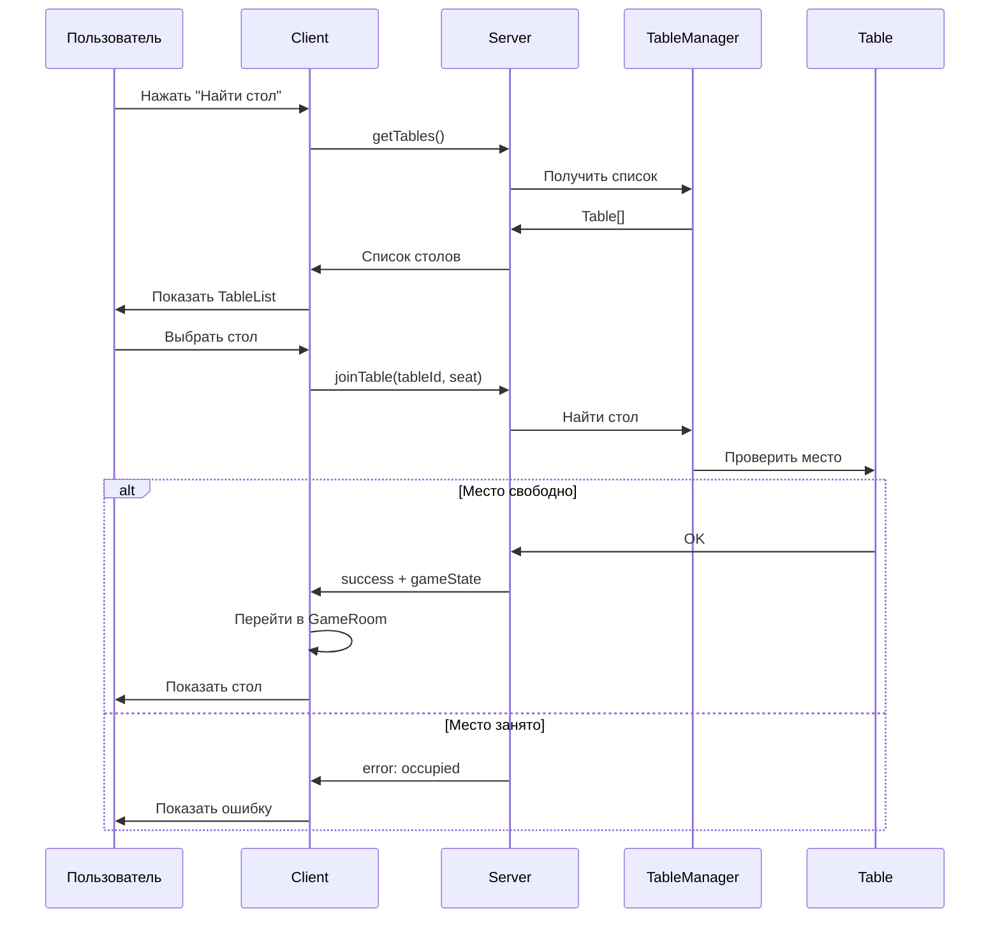

# Архитектура Telegram Mini App - Покер

## Общая схема системы



## Структура данных



## Поток данных при входе



## Поток при выборе стола



## Файловая структура

```
tg-poker/
├── client/                    # React приложение
│   ├── src/
│   │   ├── hooks/
│   │   │   └── useTelegram.ts
│   │   ├── pages/
│   │   │   ├── MainMenu.tsx
│   │   │   ├── TableList.tsx
│   │   │   └── GameRoom.tsx
│   │   ├── components/
│   │   │   ├── TableCard.tsx
│   │   │   ├── UserProfile.tsx
│   │   │   ├── BottomNav.tsx
│   │   │   └── MainButton.tsx
│   │   ├── styles/
│   │   │   └── telegram.css
│   │   └── App.tsx
│   └── package.json
├── server/
│   ├── models/
│   │   ├── User.ts
│   │   └── Table.ts
│   ├── middleware/
│   │   └── auth.ts
│   ├── config/
│   │   └── tables.ts
│   ├── TableManager.ts
│   ├── Game.ts
│   └── index.ts
├── types/
│   └── index.ts
└── plans/
    └── telegram-app-architecture.md
```

## Этапы реализации

### Фаза 1: Telegram Integration (1-2 дня)
- Подключение WebApp SDK
- Аутентификация через initData
- Базовая адаптация UI

### Фаза 2: Multi-Table (2-3 дня)
- TableManager
- Socket.io rooms
- Предопределённые столы

### Фаза 3: Главное меню (2 дня)
- React Router
- Список столов
- Навигация

### Фаза 4: Polish (2-3 дня)
- Анимации
- Haptic feedback
- Чат

### Фаза 5: Production (2 дня)
- Админка
- Безопасность
- Деплой

## Технологический стек

| Компонент | Технология |
|-----------|------------|
| Client | React + TypeScript + Vite |
| Server | Node.js + Express + Socket.io |
| State | Socket.io (real-time) |
| Auth | Telegram WebApp initData |
| Storage | Redis / MongoDB (позже) |
| UI | Telegram Design System |
